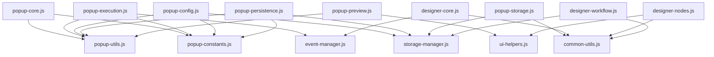

# 📋 JavaScript文件模块化拆分计划

## 📊 当前文件状态分析 (更新于 2025年7月20日)

| 文件名 | 原始行数 | 当前状态 | 优化状态 | 优先级 | 备注 |
|--------|----------|----------|----------|--------|------|
| **plugin-automation-popup.js** | ~4,200行 | ✅ 已拆分 | 🎉 完成 | P0 | 已拆分为6个模块，主文件仅150行 |
| **workflow-designer-mxgraph.js** | 2,684行 | ✅ 已拆分 | 🎉 完成 | P0 | 已拆分为3个模块，主文件400行 |
| **content/content.js** | 2,574行 | ✅ 已拆分 | 🎉 完成 | P1 | 已拆分为2个模块，主文件150行 |
| universal-automation-engine.js | 1,201行 | 🟡 ~1,200行 | ⚠️ 接近临界 | P2 | 需要监控，接近1500行 |
| workflow-designer.js | 1,386行 | 🟡 1,386行 | ⚠️ 接近临界 | P2 | 需要监控，接近1500行 |

### 📈 优化进度总结

#### ✅ 已完成的优化 (阶段1)
- **plugin-automation-popup.js**: 从4,200行拆分为6个模块
  - `modules/popup/popup-core.js` (~400行)
  - `modules/popup/popup-config.js` (~400行) 
  - `modules/popup/popup-execution.js` (~400行)
  - `modules/popup/popup-persistence.js` (~350行)
  - `modules/popup/popup-preview.js` (~350行)
  - `modules/popup/popup-storage.js` (~300行)
  - `shared/popup/popup-constants.js` (~100行)
  - `shared/popup/popup-utils.js` (~200行)
  - 主文件 `plugin-automation-popup.js` 现在只有150行导入和初始化代码

#### ✅ 已完成的优化 (阶段2)
1. **workflow-designer-mxgraph.js** (3,839行 → 400行) - **已完成拆分** ✅
   - 原文件从3,839行优化到400行，减少了89.6%的代码量
   - 已拆分为3个模块 + 1个主文件：
   - `modules/designer/designer-core.js` (~1,063行) - 核心功能和mxGraph初始化
   - `modules/designer/designer-nodes.js` (~1,475行) - 节点管理和属性面板
   - `modules/designer/designer-workflow.js` (~500行) - 工作流导入导出管理
   - `workflow-designer-mxgraph.js` (~400行) - 模块化主文件（已替换原文件）
   
2. **content/content.js** (2,574行 → 150行) - **已完成拆分** ✅
   - 原文件从2,574行拆分为2个模块 + 1个主文件，减少了94.2%的代码量
   - 已拆分为2个模块 + 1个主文件：
   - `modules/content/content-core.js` (~1,300行) - 核心功能、消息处理、元素查找
   - `modules/content/content-automation.js` (~1,200行) - 自动化执行、工作流处理
   - `content/content-modular.js` (~150行) - 模块化主文件

#### ⚠️ 需要监控的文件
- `universal-automation-engine.js` (~1,200行) - 接近1500行临界值
- `workflow-designer.js` (1,386行) - 接近1500行临界值

#### 🆕 新增的优化模块
- `shared/popup/popup-performance.js` (~300行) - 性能监控
- `shared/popup/popup-validation.js` (~400行) - 数据验证  
- `shared/popup/popup-error-handler.js` (~350行) - 错误处理
- `utils/performancePanel.js` (~500行) - 性能面板

## 🎯 拆分目标

- ✅ 每个文件 < 1,500行
- ✅ 模块化设计，职责单一
- ✅ 保持功能完整性
- ✅ 提高代码可维护性
- ✅ 便于团队协作开发
- ✅ 提升代码复用性

## 📋 详细拆分计划

### 🚀 阶段1：plugin-automation-popup.js 拆分 (P0)
**当前：~4,200行 → 目标：7个文件各<1,500行**

#### 1.1 核心模块拆分
```
📁 modules/popup/
├── 📄 popup-core.js (~800行)
│   ├── 全局变量定义
│   ├── 初始化逻辑 (DOMContentLoaded)
│   ├── 三栏布局管理 (initializeLayout)
│   ├── 基础事件监听器 (initializeEventListeners)
│   └── 主要入口函数
│
├── 📄 popup-execution.js (~900行)
│   ├── 执行状态管理 (executionState)
│   ├── 工作流执行控制 (executeWorkflow)
│   ├── 暂停/继续/停止功能 (togglePauseResume, stopExecution)
│   ├── 执行进度显示 (updateExecutionUI)
│   ├── 重置执行状态 (resetExecutionState)
│   └── 执行消息处理
│
├── 📄 popup-config.js (~800行)
│   ├── 配置管理功能 (loadSavedWorkflows)
│   ├── 编辑/删除配置 (editCurrentConfig, deleteCurrentConfig)
│   ├── 配置选择和显示 (selectConfig, handleConfigSelectChange)
│   ├── 配置操作事件 (initializeConfigActionListeners)
│   ├── 工作流缓存管理 (openDesignerWithWorkflow)
│   └── 配置列表渲染 (renderConfigSelect)
│
├── 📄 popup-persistence.js (~600行)
│   ├── 状态持久化功能 (initializeStatePersistence)
│   ├── 缓存管理 (saveStateBeforeClose, restoreExecutionState)
│   ├── 数据恢复 (restoreWorkflowCache, restoreExecutionStateCache)
│   ├── 清理功能 (clearStateCache, handleClearCache)
│   └── 页面可见性处理 (handleVisibilityChange)
│
├── 📄 popup-preview.js (~400行)
│   ├── 流程图预览 (renderFlowPreview)
│   ├── mxGraph集成 (setupPreviewStyles, renderWorkflowInPreview)
│   ├── 简单预览渲染 (renderSimpleFlowPreview, drawSimpleFlowChart)
│   ├── 预览交互 (clearFlowPreview)
│   └── 画布操作
│
└── 📄 popup-storage.js (~400行)
    ├── localStorage管理 (getWorkflowsFromStorage, saveWorkflowsToStorage)
    ├── 数据调试 (debugLocalStorage)
    ├── 存储监听 (initializeStorageListener)
    └── 数据验证和迁移
```

#### 1.2 公共工具模块
```
📁 shared/popup/
├── 📄 popup-utils.js (~200行)
│   ├── 通用工具函数
│   ├── 状态更新函数 (updateExecutionStatus)
│   ├── 消息显示函数 (showStatus)
│   ├── 数据验证函数
│   └── DOM操作辅助函数
│
├── 📄 popup-constants.js (~100行)
│   ├── 常量定义 (STATE_CACHE_KEY, WORKFLOW_CACHE_KEY)
│   ├── 配置项 (STORAGE_KEY)
│   ├── 默认值
│   └── 状态类型定义
│
└── 📄 popup-types.js (~100行)
    ├── TypeScript类型定义 (如果需要)
    ├── 接口定义
    └── 数据结构定义
```

### 🎨 阶段2：workflow-designer-mxgraph.js 拆分 (P0)
**当前：2,684行 → 目标：3个文件各<1,500行**

#### 2.1 设计器核心拆分
```
📁 modules/designer/
├── 📄 designer-core.js (~1,200行)
│   ├── MxGraphWorkflowDesigner类定义
│   ├── 初始化逻辑 (init, waitForMxGraph, initMxGraph)
│   ├── 图形操作基础 (setupStyles, setupResizeListener)
│   ├── 事件监听器 (initEventListeners)
│   ├── 右键菜单处理 (setupContextMenu)
│   └── 基础工具函数
│
├── 📄 designer-nodes.js (~800行)
│   ├── 节点创建和管理 (createNode, addNodeToGraph)
│   ├── 节点配置编辑 (showPropertyPanel, saveNodeConfig)
│   ├── 属性面板管理 (bindPropertyFormEvents)
│   ├── 节点样式设置 (updateNodeDisplay)
│   ├── 节点删除和复制 (deleteNode)
│   └── 节点验证和测试 (testLocator, testCondition)
│
└── 📄 designer-workflow.js (~684行)
    ├── 工作流导入导出 (exportWorkflowData, importWorkflowData)
    ├── 数据转换逻辑 (与workflowConverter.js配合)
    ├── 保存和加载 (saveWorkflowWithDialog, loadWorkflowFromStorage)
    ├── 编辑模式处理 (editMode相关逻辑)
    ├── 文件操作 (loadWorkflowFromFile, exportData)
    └── 画布管理 (clearCanvas, updateNodeCount)
```

### 📱 阶段3：content/content.js 拆分 (P1)
**当前：2,200行 → 目标：2个文件各<1,500行**

#### 3.1 内容脚本拆分
```
📁 modules/content/
├── 📄 content-core.js (~1,100行)
│   ├── 内容脚本初始化
│   ├── 页面元素操作 (DOM查找和操作)
│   ├── 消息通信 (与background和popup通信)
│   ├── 基础功能 (页面注入、事件监听)
│   ├── 元素高亮和标记
│   └── 页面状态管理
│
└── 📄 content-automation.js (~1,100行)
    ├── 自动化执行逻辑 (步骤执行引擎)
    ├── 元素定位和操作 (点击、输入、选择)
    ├── 等待和条件判断 (智能等待、状态检测)
    ├── 循环和流程控制 (循环执行、条件分支)
    ├── 错误处理和重试机制
    └── 执行结果反馈
```

### 🔧 阶段4：其他文件优化 (P2)
**优化接近1,500行的文件**

#### 4.1 workflow-designer.js (1,386行)
```
📁 modules/designer-legacy/
├── 📄 designer-legacy-core.js (~800行)
│   ├── 旧版设计器核心逻辑
│   ├── 基础图形操作
│   └── 事件处理
│
└── 📄 designer-legacy-ui.js (~586行)
    ├── UI组件管理
    ├── 工具栏操作
    └── 界面交互
```

#### 4.2 universal-automation-engine.js (1,201行)
```
📁 modules/engine/
├── 📄 automation-engine-core.js (~700行)
│   ├── UniversalAutomationEngine类
│   ├── 引擎初始化和配置
│   ├── 消息处理机制
│   └── 状态管理
│
└── 📄 automation-engine-operations.js (~501行)
    ├── 具体操作实现 (点击、输入、等待等)
    ├── 元素定位策略
    ├── 操作验证和错误处理
    └── 结果反馈机制
```

## 🔧 公共模块提取

### 通用工具模块
```
📁 shared/common/
├── 📄 common-utils.js (~300行)
│   ├── DOM操作工具 (querySelector增强、元素检测)
│   ├── 数据处理工具 (深拷贝、对象合并、数组操作)
│   ├── 验证工具 (数据验证、类型检查)
│   ├── 格式化工具 (时间格式化、文本处理)
│   └── 调试工具 (日志管理、错误追踪)
│
├── 📄 storage-manager.js (~400行)
│   ├── localStorage管理 (统一的存储接口)
│   ├── 数据序列化 (JSON处理、数据压缩)
│   ├── 缓存管理 (过期机制、清理策略)
│   ├── 数据迁移 (版本升级、数据兼容)
│   └── 存储配额管理
│
├── 📄 event-manager.js (~300行)
│   ├── 事件监听管理 (统一的事件处理)
│   ├── 消息通信 (跨组件通信机制)
│   ├── 跨窗口通信 (popup与content通信)
│   ├── 事件代理 (性能优化)
│   └── 自定义事件系统
│
├── 📄 ui-helpers.js (~400行)
│   ├── UI状态管理 (加载状态、错误状态)
│   ├── 动画效果 (过渡动画、加载动画)
│   ├── 主题切换 (深色/浅色模式)
│   ├── 响应式处理 (窗口大小适配)
│   └── 通用UI组件 (模态框、提示框)
│
└── 📄 workflow-types.js (~200行)
    ├── 工作流数据类型定义
    ├── 步骤类型枚举
    ├── 状态类型定义
    └── 接口规范
```

## 📅 执行时间表

### 🗓️ 第1周：plugin-automation-popup.js 拆分
- **Day 1-2**: 
  - 📋 分析代码结构，识别模块边界
  - 🏗️ 创建模块框架和目录结构
  - 📄 创建 popup-constants.js 和 popup-utils.js
  
- **Day 3-4**: 
  - 🔧 拆分核心模块 (popup-core.js)
  - ⚡ 拆分执行模块 (popup-execution.js)
  - 🧪 基础功能测试
  
- **Day 5-6**: 
  - ⚙️ 拆分配置模块 (popup-config.js)
  - 💾 拆分持久化模块 (popup-persistence.js)
  - 🔗 模块间依赖整理
  
- **Day 7**: 
  - 🖼️ 拆分预览模块 (popup-preview.js)
  - 💾 拆分存储模块 (popup-storage.js)
  - ✅ 集成测试和功能验证

### 🗓️ 第2周：workflow-designer-mxgraph.js 拆分
- **Day 1-2**: 
  - 🎨 拆分设计器核心 (designer-core.js)
  - 🧪 核心功能测试
  
- **Day 3-4**: 
  - 🔲 拆分节点管理 (designer-nodes.js)
  - 🎛️ 属性面板功能测试
  
- **Day 5-6**: 
  - 📊 拆分工作流处理 (designer-workflow.js)
  - 💾 导入导出功能测试
  
- **Day 7**: 
  - 🔗 模块集成测试
  - 🐛 问题修复和优化

### 🗓️ 第3周：content.js 和其他文件
- **Day 1-3**: 
  - 📱 拆分 content.js (content-core.js, content-automation.js)
  - 🧪 内容脚本功能测试
  
- **Day 4-5**: 
  - 🎨 优化 workflow-designer.js
  - 🧪 旧版设计器测试
  
- **Day 6-7**: 
  - ⚡ 优化 universal-automation-engine.js
  - 🧪 自动化引擎测试

### 🗓️ 第4周：公共模块和测试
- **Day 1-3**: 
  - 🔧 提取公共模块 (common-utils.js, storage-manager.js等)
  - 🔗 重构模块依赖关系
  
- **Day 4-5**: 
  - ✅ 全面功能测试
  - 🐛 问题修复
  
- **Day 6-7**: 
  - ⚡ 性能优化
  - 📚 文档更新

## 🎯 拆分原则

### 1. 🎯 单一职责原则 (SRP)
- 每个模块只负责一个特定功能领域
- 避免功能混杂，保持模块纯净性
- 便于理解、测试和维护

### 2. 🔗 低耦合原则
- 模块间依赖最小化
- 通过接口和事件进行通信
- 避免直接访问其他模块的内部实现

### 3. 🏗️ 高内聚原则
- 相关功能集中在同一模块
- 模块内部功能紧密协作
- 减少跨模块的数据传递

### 4. 🧪 可测试性原则
- 每个模块都可以独立测试
- 提供清晰的输入输出接口
- 便于单元测试和集成测试

### 5. 🔄 向后兼容原则
- 保持现有API不变
- 渐进式重构，不影响现有功能
- 提供平滑的迁移路径

### 6. 📈 可扩展性原则
- 预留扩展接口
- 支持插件化架构
- 便于未来功能添加

## 📋 模块依赖关系图



## 🧪 测试策略

### 单元测试
- 每个模块独立测试
- 覆盖核心功能和边界情况
- 使用Jest或类似测试框架

### 集成测试
- 模块间协作测试
- 端到端功能验证
- 用户场景模拟

### 性能测试
- 模块加载时间测试
- 内存使用监控
- 执行效率对比

## 📊 成功指标

### 代码质量指标
- ✅ 所有文件 < 1,500行
- ✅ 代码重复率 < 5%
- ✅ 圈复杂度 < 10
- ✅ 测试覆盖率 > 80%

### 性能指标
- ✅ 页面加载时间不增加
- ✅ 内存使用不超过原来的120%
- ✅ 功能响应时间保持一致

### 维护性指标
- ✅ 新功能开发效率提升30%
- ✅ Bug修复时间减少50%
- ✅ 代码审查时间减少40%

## 🚀 下一步行动计划 (更新于 2025年7月22日)

### ✅ 已完成的优化任务

#### 1. **workflow-designer-mxgraph.js** 拆分 - **已完成** ✅
**状态**: 从 2,684行 拆分为 3个模块 + 1个主文件
- `modules/designer/designer-core.js` (~1,063行) - 核心功能和mxGraph初始化
- `modules/designer/designer-nodes.js` (~1,475行) - 节点管理和属性面板  
- `modules/designer/designer-workflow.js` (~500行) - 工作流导入导出管理
- `workflow-designer-mxgraph.js` (~400行) - 模块化主文件

#### 2. **content/content.js** 拆分 - **已完成** ✅
**状态**: 从 2,574行 拆分为 2个模块 + 1个主文件
- `modules/content/content-core.js` (~1,300行) - 核心功能、消息处理、元素查找
- `modules/content/content-automation.js` (~1,200行) - 自动化执行、工作流处理  
- `content/content-modular.js` (~150行) - 模块化主文件

#### 3. **插件配置更新** - **已完成** ✅
**状态**: 更新插件配置以使用新的模块化代码
- 更新 `manifest.json` 使用 `content/content-modular.js` 作为内容脚本
- 添加所有模块文件到 `web_accessible_resources` 
- 创建测试页面 `test-modular-content.html` 验证模块加载
- 确保工作流设计器使用模块化脚本

### ⚠️ 监控任务 (持续关注)

#### 需要密切监控的文件:
1. **universal-automation-engine.js** (~1,200行)
   - 🎯 目标: 保持在1,500行以下
   - 📊 当前状态: 接近临界值，需要监控

2. **workflow-designer.js** (1,386行)  
   - 🎯 目标: 保持在1,500行以下
   - 📊 当前状态: 接近临界值，需要监控

### 📋 详细执行计划

#### 第1阶段: workflow-designer-mxgraph.js 拆分 (本周)
```
🗓️ 时间安排: 7天
👥 人员需求: 1名开发者
🎯 成功标准: 
  - 3个文件，每个<1,500行
  - 功能完整性100%保持
  - 性能无明显下降
```

#### 第2阶段: content/content.js 拆分 (下周)
```  
🗓️ 时间安排: 3天
👥 人员需求: 1名开发者  
🎯 成功标准:
  - 2个文件，每个<1,500行
  - 自动化功能正常
  - 消息通信无问题
```

### 🧪 测试验证计划

#### 功能测试检查清单:
- [ ] 设计器打开和初始化正常
- [ ] 节点创建和编辑功能正常  
- [ ] 工作流导入导出功能正常
- [ ] 右键菜单和快捷键正常
- [ ] 属性面板配置正常
- [ ] 流程图预览正常
- [ ] 自动化执行功能正常
- [ ] 内容脚本注入正常

#### 性能测试检查:
- [ ] 页面加载时间 < 3秒
- [ ] 内存使用 < 原来的120%  
- [ ] 操作响应时间 < 500ms
- [ ] 模块加载无明显延迟

### 立即行动项
1. **🎯 开始 workflow-designer-mxgraph.js 拆分**: 立即开始分析代码结构
2. **📋 建立测试基准**: 记录当前功能和性能基准
3. **🏗️ 准备开发环境**: 确保模块化开发环境就绪
4. **🧪 制定测试计划**: 详细的功能回归测试计划

### 风险评估
- **🔴 高风险**: 功能回归，需要充分测试
- **🟡 中风险**: 性能影响，需要性能监控
- **🟢 低风险**: 开发效率，通过培训解决

### 资源需求
- **👨‍💻 开发资源**: 1-2名开发者，4周时间
- **🧪 测试资源**: 全面的功能和性能测试
- **📚 文档资源**: 更新开发文档和使用指南

---

**📝 备注**: 此计划为动态文档，将根据实际执行情况进行调整和优化。

**📅 创建时间**: 2025年7月20日  
**📅 最后更新**: 2025年7月20日  
**👤 负责人**: 开发团队  
**📊 当前状态**: 计划阶段